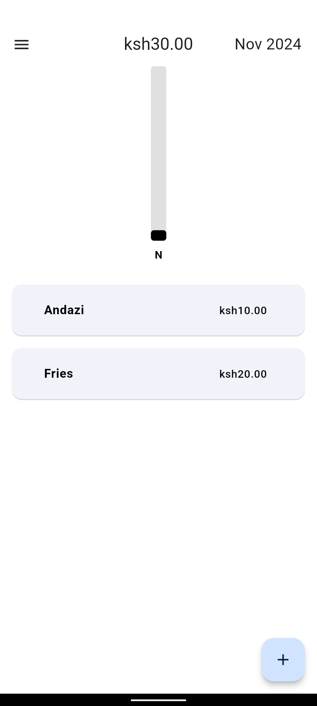

# Expense Tracker

A simple Flutter application that helps you track your expenses with monthly and yearly summaries, built with SQLite for offline data persistence.

## Features

- **Add, Edit, and Delete Expenses**: Easily manage expenses.
- **Monthly and Yearly Summaries**: View detailed spending summaries.
- **Data Persistence**: Stores data locally using SQLite for offline access.
- **Interactive Bar Graphs**: Visualize monthly expenses with bar charts.
- **Theme Support**: Light and Dark mode options for a comfortable user experience.

## App Screenshots

  
  
  
  
  
  
  
  

